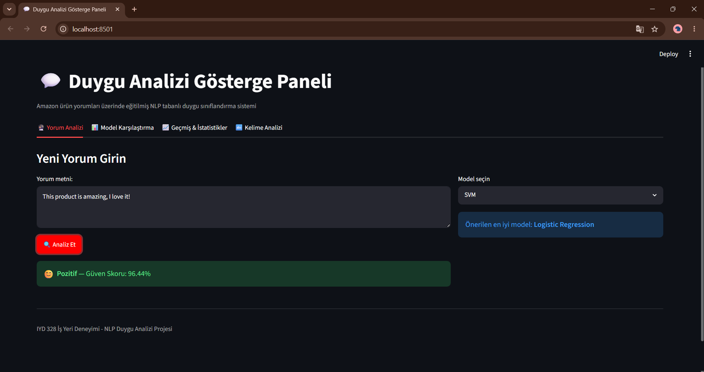
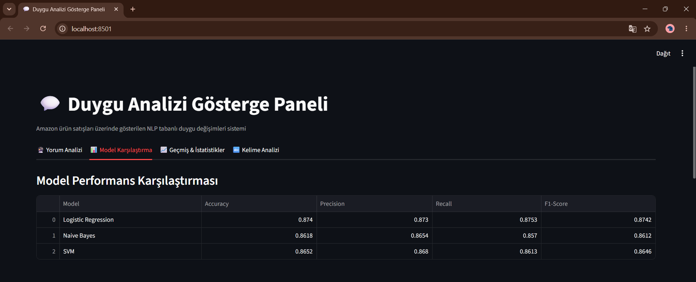
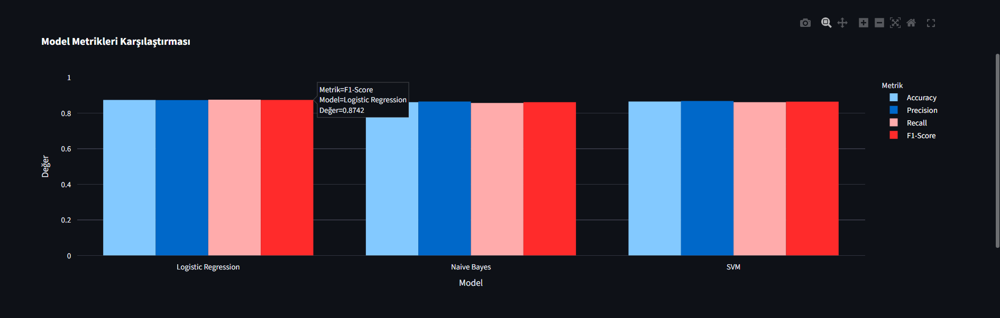
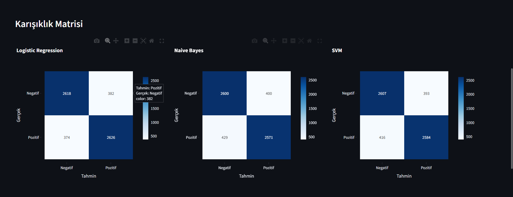
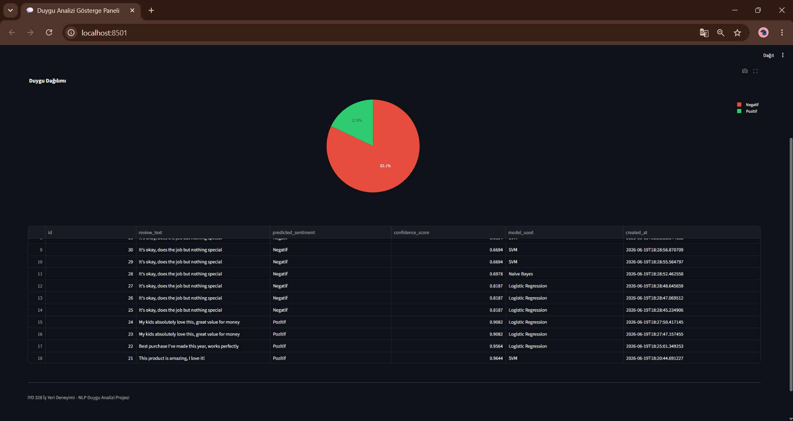
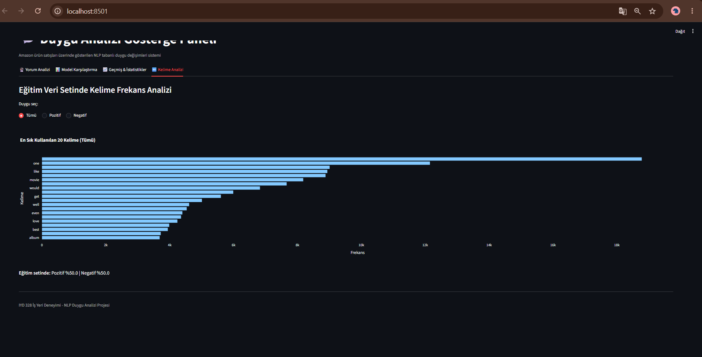

# Duygu Analizi Gösterge Paneli (Sentiment Analysis Dashboard)

IYD 328 - İş Yeri Deneyimi dersi kapsamında geliştirilmiş, müşteri yorumlarını otomatik olarak
**Pozitif** veya **Negatif** olarak sınıflandıran uçtan uca bir NLP + makine öğrenmesi sistemi.

## Proje Özeti

Sistem; metin verisini temizler, TF-IDF ile özellik çıkarımı yapar, üç farklı makine öğrenmesi
modeli eğitip karşılaştırır, tahminleri bir SQLite veritabanında saklar ve sonuçları interaktif
bir Streamlit gösterge paneli üzerinden görselleştirir.

## Veri Seti

Bu projede, Adam Bittlingmayer tarafından hazırlanmış **Amazon Reviews** veri seti kullanılmıştır:
https://www.kaggle.com/datasets/bittlingmayer/amazonreviews

- Format: fastText formatı (`__label__1` = negatif, `__label__2` = pozitif)
- Kullanılan örnek: `test.ft.txt` dosyasından dengeli şekilde seçilmiş **30.000 yorum**
  (15.000 pozitif / 15.000 negatif)
- Veri seti gerçek Amazon müşteri yorumlarından oluşmaktadır ve eksiksiz bir NLP pipeline'ı
  geliştirmek için uygundur.

> Not: Projede önerilen "Amazon Alexa Reviews" yerine, aynı yazarın daha kapsamlı genel
> Amazon ürün yorumları veri seti kullanılmıştır; format ve amaç (ikili duygu sınıflandırması)
> birebir aynıdır.

## Sistem Tasarımı

```
data/test.ft.txt  --> prepare_dataset.py --> data/reviews_clean.csv
                                                    |
                                                    v
                                          src/train_models.py
                                       (TF-IDF + 3 Model Eğitimi)
                                                    |
                                                    v
                                      models/*.joblib + metrics.json
                                                    |
                                                    v
                              app.py (Streamlit) <--+--> data/sentiment.db (SQLite)
```

### Klasör Yapısı
```
sentiment-dashboard/
├── app.py                    # Streamlit ana uygulaması
├── requirements.txt
├── data/
│   ├── test.ft.txt           # Ham veri (gitignore'da, indirilmesi gerekir)
│   └── reviews_clean.csv     # Temizlenmiş/işlenmiş veri (30K satır)
├── models/
│   ├── vectorizer.joblib
│   ├── logistic_regression.joblib
│   ├── naive_bayes.joblib
│   ├── svm.joblib
│   ├── best_model_name.joblib
│   └── metrics.json
└── src/
    ├── preprocessing.py       # Metin temizleme, tokenization, stopword kaldırma
    ├── prepare_dataset.py     # Ham veriyi örnekleyip CSV'ye dönüştürür
    ├── train_models.py        # 3 model eğitimi + değerlendirme
    └── database.py            # SQLite veritabanı işlemleri
```

## NLP Ön İşleme Süreci

1. **Metin temizleme**: HTML tag, URL ve özel karakterlerin kaldırılması
2. **Küçük harfe dönüştürme**
3. **Tokenization**: NLTK `word_tokenize`
4. **Stopword kaldırma**: İngilizce stopword listesi (NLTK)
5. **Özellik çıkarımı**: TF-IDF (unigram + bigram, max 8000 özellik)

## Model Seçimi ve Gerekçesi

Üç farklı algoritma ailesi karşılaştırılmıştır:

| Model | Neden Seçildi |
|---|---|
| **Logistic Regression** | Yüksek boyutlu, seyrek (sparse) TF-IDF verisinde hızlı ve güçlü doğrusal temel çizgi |
| **Multinomial Naive Bayes** | Metin sınıflandırmada klasik, hızlı ve olasılıksal bir karşılaştırma noktası |
| **Linear SVM (LinearSVC)** | Yüksek boyutlu uzaylarda genelde en iyi performans gösteren margin-based sınıflandırıcı |

## Değerlendirme Sonuçları

(30.000 satırlık veri, %80 eğitim / %20 test ayrımı, stratified split)

| Model | Accuracy | Precision | Recall | F1-Score |
|---|---|---|---|---|
| **Logistic Regression** | 0.874 | 0.873 | 0.875 | **0.874** |
| SVM (Linear) | 0.865 | 0.868 | 0.861 | 0.865 |
| Naive Bayes | 0.862 | 0.865 | 0.857 | 0.861 |

**En iyi model: Logistic Regression** (dashboard'da varsayılan olarak önerilir, kullanıcı diğer
modelleri de seçip karşılaştırabilir).

Confusion matrix'ler ve detaylı metrikler `models/metrics.json` dosyasında ve dashboard'un
"Model Karşılaştırma" sekmesinde görselleştirilmiştir.

## Veritabanı Şeması (SQLite)

```sql
CREATE TABLE predictions (
    id INTEGER PRIMARY KEY AUTOINCREMENT,
    review_text TEXT NOT NULL,
    predicted_sentiment TEXT NOT NULL,
    confidence_score REAL,
    model_used TEXT,
    created_at TEXT NOT NULL
);
```

## Gösterge Paneli Özellikleri

1. **Yorum Analizi**: Kullanıcı serbest metin girer, model seçer, anlık tahmin + güven skoru alır
2. **Model Karşılaştırma**: 3 modelin metrikleri ve confusion matrix'leri yan yana
3. **Geçmiş & İstatistikler**: Tüm geçmiş tahminler, duygu dağılım grafiği
4. **Kelime Analizi**: Pozitif/Negatif yorumlarda en sık kullanılan 20 kelime

## Kurulum ve Çalıştırma

### 1. Bağımlılıkları kurun
```bash
pip install -r requirements.txt
```

### 2. Ham veriyi indirin
[Kaggle - Amazon Reviews](https://www.kaggle.com/datasets/bittlingmayer/amazonreviews)
adresinden `test.ft.txt.bz2` dosyasını indirip `data/` klasörüne çıkartın:
```bash
bzip2 -d test.ft.txt.bz2
```

### 3. Veri setini hazırlayın
```bash
python src/prepare_dataset.py
```

### 4. Modelleri eğitin
```bash
python src/train_models.py
```

### 5. Veritabanını oluşturun
```bash
python src/database.py
```

### 6. Dashboard'u başlatın
```bash
streamlit run app.py
```

Tarayıcıda `http://localhost:8501` adresinden erişilebilir.

## Kullanılan Teknolojiler

- **Python 3.12**
- **scikit-learn** — TF-IDF, Logistic Regression, Naive Bayes, SVM
- **NLTK** — tokenization, stopwords
- **Streamlit** — interaktif dashboard
- **Plotly** — görselleştirmeler
- **SQLite** — tahmin geçmişi depolama
- **pandas / joblib** — veri işleme ve model serileştirme

## Öğrenim Çıktıları

Bu proje kapsamında: Doğal Dil İşleme, metin ön işleme teknikleri, makine öğrenmesi
sınıflandırması, model değerlendirme metrikleri, SQL veritabanı entegrasyonu, veri
görselleştirme, dashboard geliştirme ve Git/GitHub sürüm kontrolü konularında uygulamalı
deneyim kazanılmıştır.

## Ekran Görüntüleri

### Yorum Analizi


### Model Karşılaştırma




### Geçmiş & İstatistikler


### Kelime Analizi


---
**Ders:** IYD 328 - İş Yeri Deneyimi | **Dönem:** 2025-2026 Bahar
